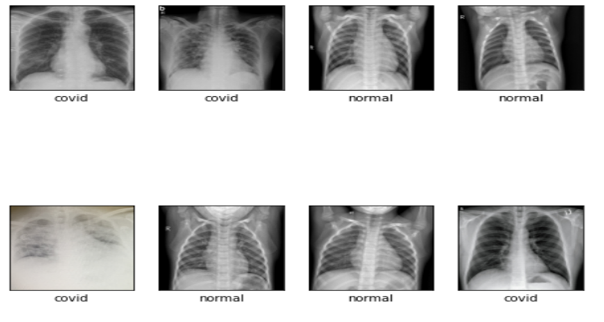
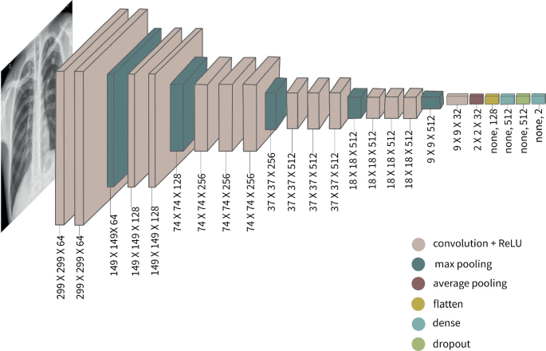
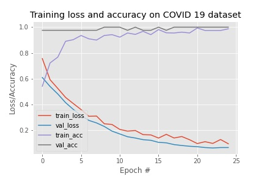

#          <h2 align="center">COVID-19-Detection using chest X-RAY images</h2>

###        <h3 align="center">1.Introduction and Abstract</h3>

In this [project](Covid_19.ipynb), we performed the binary classification of chest x-ray images using the Neural Network Model to find whether the patient is COVID-19 positive or normal. Most of the Computer Vision tasks are surrounded around CNN architectures, as the basis of most of the problems is to classify an image into known labels. Artificial neural networks were great for the task which wasn’t possible for Conventional Machine learning algorithms, but in the case of processing images with fully connected hidden layers, ANN takes a very long time to be trained. Due to this, CNN was used to first reduce the size of images using convolutional layers and pooling layers and then feed the reduced data to fully connected layers. A CNN-based [VGG16](covid19-vgg16.h5) model is used here for classification.

###         <h3 align="center">2.Dataset</h3>

The [dataset](DATASET) on which the project is implemented is fetched from [Kaggle](https://www.kaggle.com/) to conduct the experiment on it. The dataset contains images of [covid](DATASET/COVID) and [normal](DATASET/NORMAL) x-rays. We divided it into two halves training and testing. 80% of the data is used for training and 20% is used for testing.

###          <h3 align="center">3.VGG16</h3>

[VGG16](https://www.mathworks.com/help/deeplearning/ref/vgg16.html) is a simple and widely used Convolutional Neural Network (CNN) Architecture used for ImageNet, a large visual database project used in visual object recognition software research. The VGG16 Architecture was developed and introduced by Karen Simonyan and Andrew Zisserman from the University of Oxford, in the year 2014, through their article “Very Deep Convolutional Networks for Large-Scale Image Recognition.” ‘VGG’ is the abbreviation for [Visual Geometry Group](https://www.robots.ox.ac.uk/~vgg/), which is a group of researchers at the University of Oxford who developed this architecture, and ‘16’ implies that this architecture 

###          <h3 align="center">4.Method</h3>

- Method and Parameters used in this project: 

    - VGG16 as base model
    - Added Two dense layers
    - Activation Function: Softmax 
    - Learning rate : 10-3
    - Epochs : 25

- Software Requirements:

    - Programming Language: Python
    - Framework: Tensorflow
    - IDE: Google Colaboratory
    - Libraries: Numpy, Matplotlib, pandas, cv2
 
###         <h3 align="center">5.Result</h3>

-    The results based on our experiment:   
    
         loss and accuracy 

###          <h3 align="center">6.Conclusion and Future Direction</h3>

We achieved the classification accuracy of approximately 98%. This experiment has been performed on a small dataset. However, a larger dataset is required to train the network more efficiently. We recommend introducing more image classes related to X-ray images. Further work can be done by training the network with variants of the COVID-19 virus.  

#          <h1 align="center">Instructor</h1>

 - Phd. Khaja Raoufuddin Ahmed

  &emsp;
   <a target="_blank" href="https://www.linkedin.com/in/khaja-raoufuddin-ahmed-10110b63/" ></img></a>
 

 
